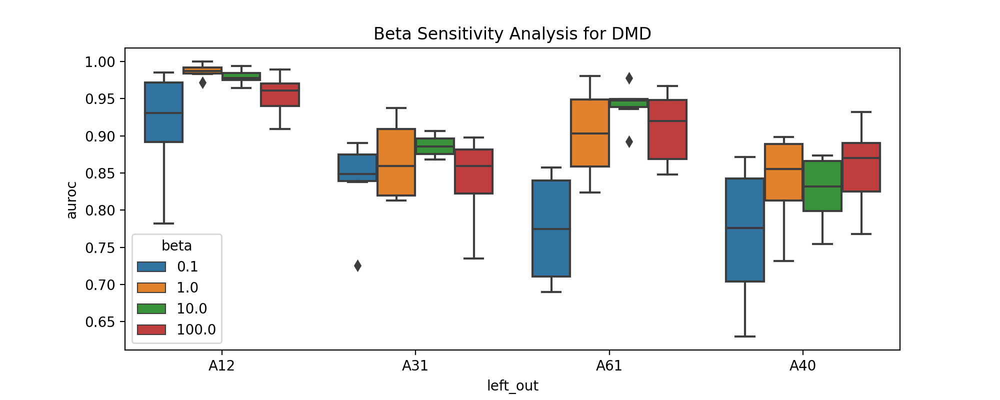
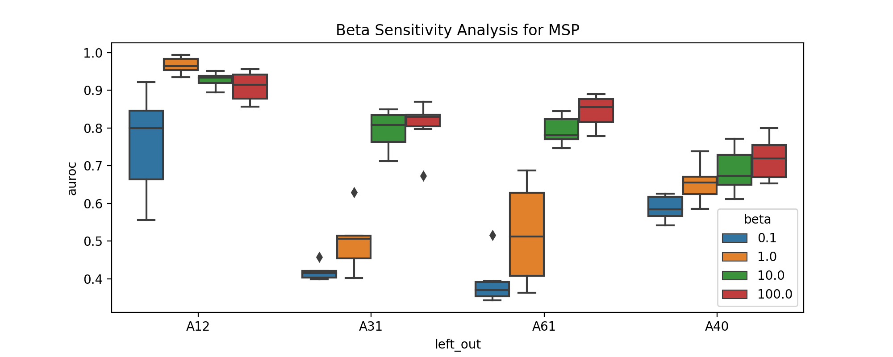
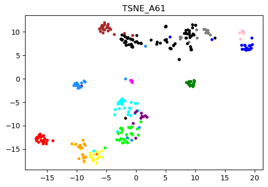
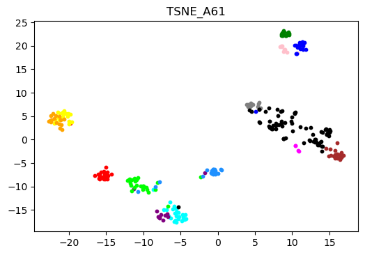

# Novel Fault Detection with Hierarchical Labels

[](https://arxiv.org/abs/2403.17891)

This repository contains experiment code for hierarchical anomaly and novelty
detection on a hot steel rolling image dataset. The project compares flat
classification against hierarchy-aware soft-label training, then evaluates
out-of-distribution detection behavior with metrics and plots such as MSP,
ODIN, and Mahalanobis/GDA distance summaries.

This code accompanies the paper
[Image-based Novel Fault Detection with Deep Learning Classifiers using Hierarchical Labels](https://arxiv.org/abs/2403.17891),
accepted in IISE Transactions.

## Selected Figures

Representative figures from the paper experiments are included below. These
summaries show how hierarchy-aware training affects detection performance across
left-out fault classes and soft-label temperature settings.





The t-SNE visualizations below compare learned feature separation for the A61
left-out fault scenario under flat and hierarchical training.

<p align="center">
  
  
</p>

## Repository Structure

```text
.
|-- src/
|   |-- datasets/          # Dataset loading and image transforms
|   |-- models/            # PyTorch model definitions
|   |-- gda.py             # Gaussian discriminant analysis utilities
|   |-- losses.py          # Hierarchical soft-label loss
|   |-- tree.py            # Hierarchy construction and label transforms
|   `-- utils.py           # Shared training, logging, and plotting helpers
|-- tests/                 # Unit tests for hierarchy and dataset behavior
|-- testtime/              # Example cached outputs and report artifacts
|-- docs/figures/          # Selected figures for the README
|-- hypothesis1_log.py     # Metaflow training workflow
|-- hypothesis1_derivatives_log.py
|                           # Cached logits and derivative metric workflow
|-- hypothesis1results_log.py
|                           # Streamlit/report generation workflow
|-- run_hypothesis1.sh     # GNU Parallel batch launcher
|-- rolling_hierarchy_description.json
|                           # Rolling dataset class hierarchy
`-- environment.yml        # Conda environment specification
```

## Setup

Create the Conda environment:

```bash
conda env create -f environment.yml
conda activate cifar100coarse
```

Create a local `.env` file from the example:

```bash
cp .env.example .env
```

Update the paths in `.env` for your machine:

```bash
ROLLING_DATA_PATH=/path/to/rolling-dataset
CHECKPOINT_DIR=/path/to/checkpoints
ARTIFACTS_DIR=/path/to/artifacts
DERIVATIVES_DIR=/path/to/derivatives
REPORT_DIR=/path/to/reports
```

The checkpoint directory must exist before importing `settings.py`. Model
checkpoints are not included in this repository because they are large generated
artifacts.

## Running Tests

```bash
pytest tests
```

## Experiment Workflow

Train models with the Metaflow workflow:

```bash
python hypothesis1_log.py run \
  --modelType hier \
  --leftOut A61_PassWear_I \
  --numEpochs 300 \
  --beta 1 \
  --learningRate 0.0001 \
  --trainSeed 2
```

Generate cached derivative outputs for repeated metric calculations:

```bash
python hypothesis1_derivatives_log.py
```

Launch the Streamlit report interface:

```bash
streamlit run hypothesis1results_log.py
```

For large sweeps, `run_hypothesis1.sh` shows the GNU Parallel commands used to
run multiple seeds, left-out classes, and hyperparameter settings.

## Notes

- `rolling_hierarchy_description.json` defines the coarse-to-fine label
  hierarchy used by the tree utilities and soft-label transforms.
- `testtime/` contains example outputs from a prior run, including summary CSVs,
  sensitivity plots, t-SNE visualizations, and report PDFs.
- Local secrets, generated SSH keys, and machine-specific `.env` files are
  intentionally ignored by Git.
